River Raid Level Rendering in PHP
=================================

This is a supporting repository for the [River Raid Disassembly](https://github.com/morozov/river-raid-disasm) project. It is used for validation and prototyping of the logic of rendering River Raid levels in a higher-level language.

Usage
-----
1. Make sure you have PHP 8 and the GD extension installed.
2. Optionally, install development dependencies:
   ```
   $ composer install
   ```
3. Render the levels:
   ```
   $ php bin/main.php
   ```
   The generated images will be stored in the `build/` directory.

Rendered Levels
---------------

<details>
   <summary>Warning! A lot of images</summary>

   ### Level 1
   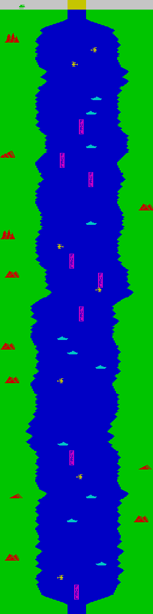
   ### Level 2
   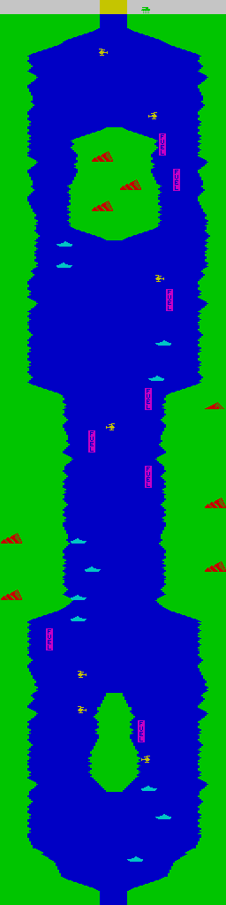
   ### Level 3
   
   ### Level 4
   
   ### Level 5
   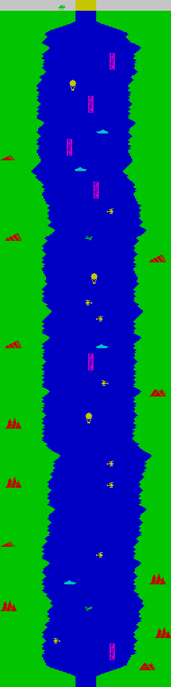
   ### Level 6
   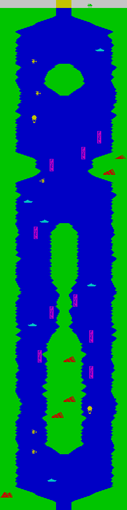
   ### Level 7
   
   ### Level 8
   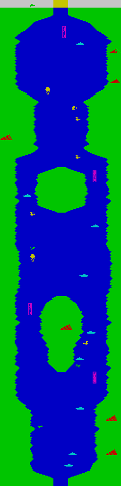
   ### Level 9
   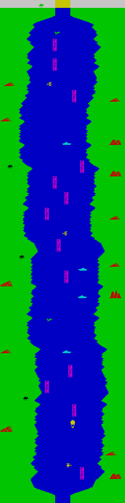
   ### Level 10
   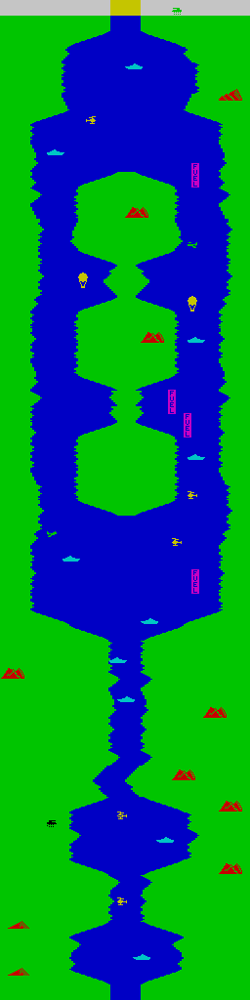
   ### Level 11
   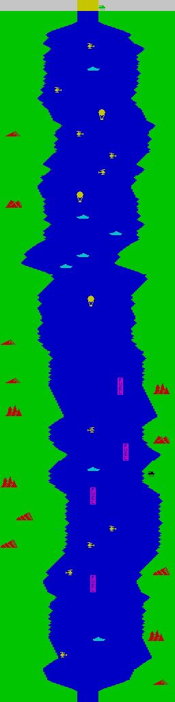
   ### Level 12
   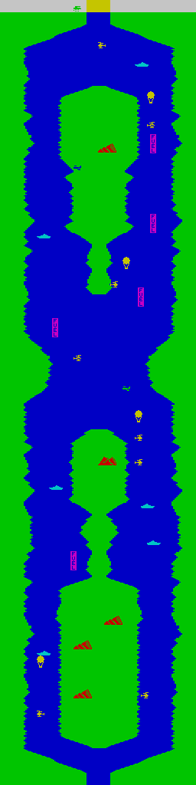
   ### Level 13
   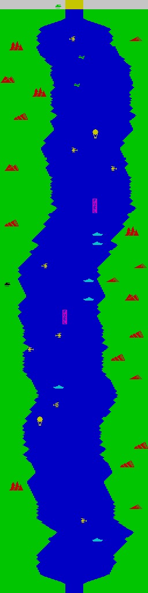
   ### Level 14
   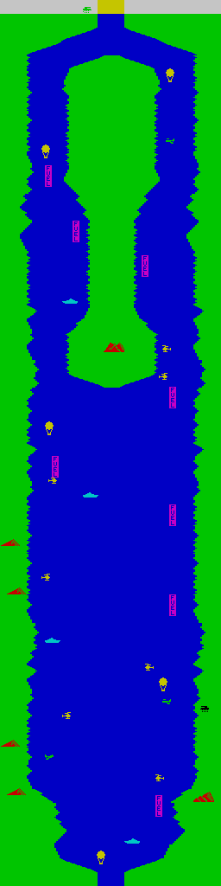
   ### Level 15
   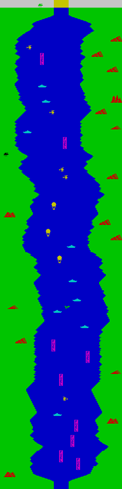
   ### Level 16
   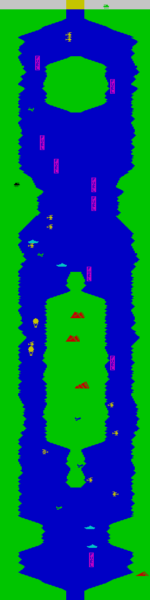
   ### Level 17
   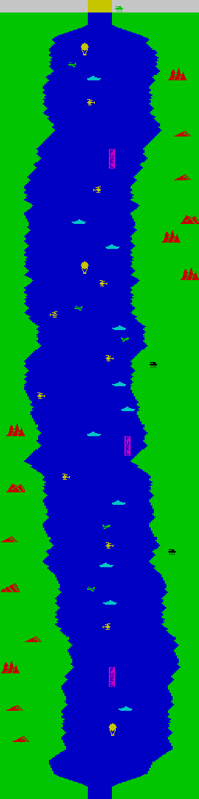
   ### Level 18
   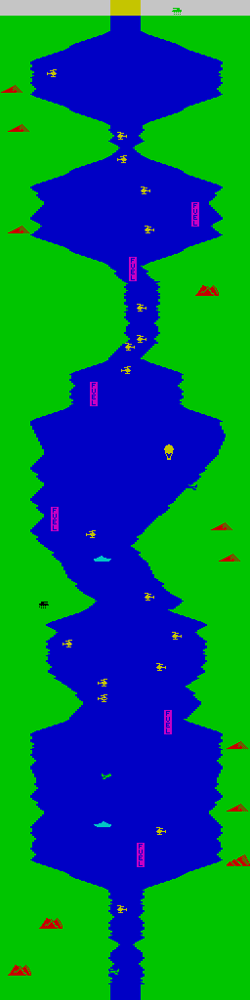
   ### Level 19
   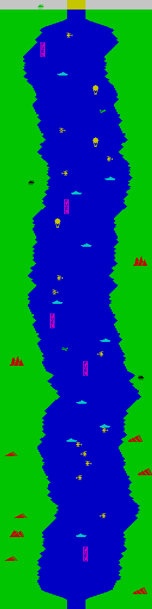
   ### Level 20
   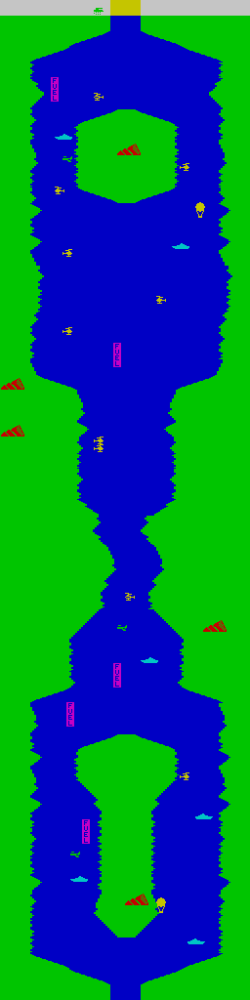
   ### Level 21
   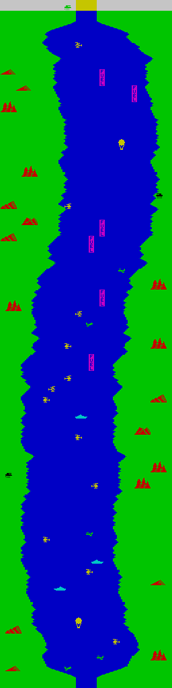
   ### Level 22
   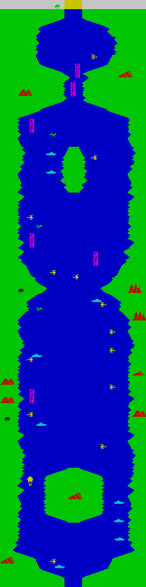
   ### Level 23
   
   ### Level 24
   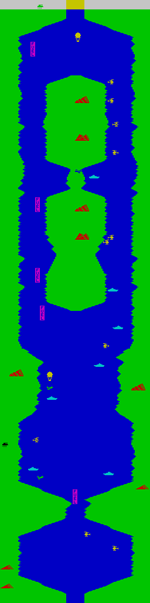
   ### Level 25
   
   ### Level 26
   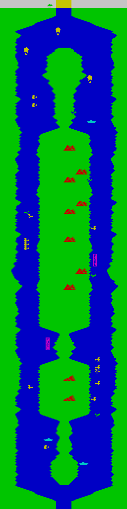
   ### Level 27
   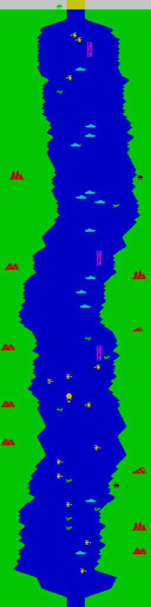
   ### Level 28
   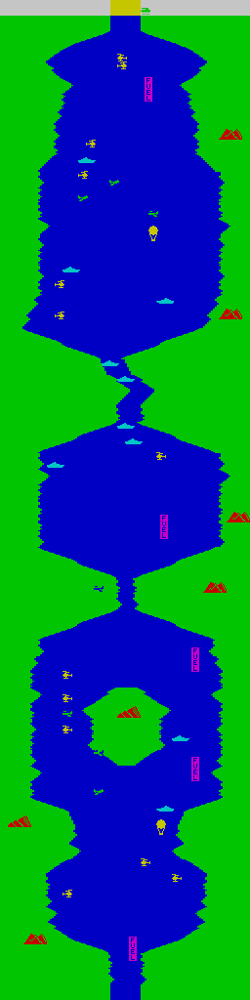
   ### Level 29
   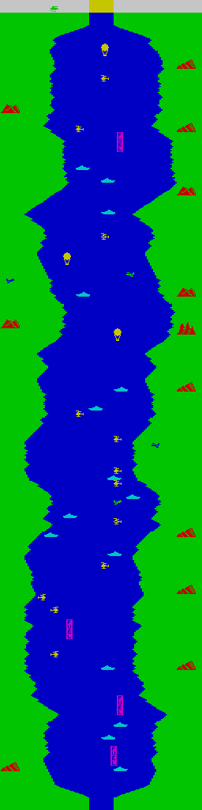
   ### Level 30
   
   ### Level 31
   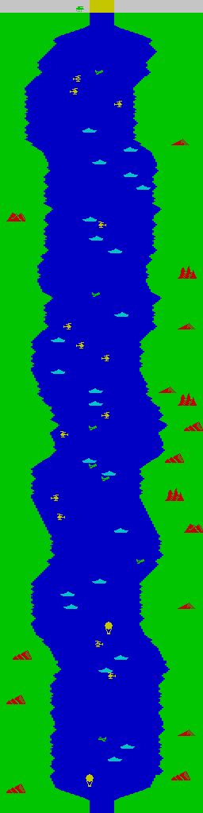
   ### Level 32
   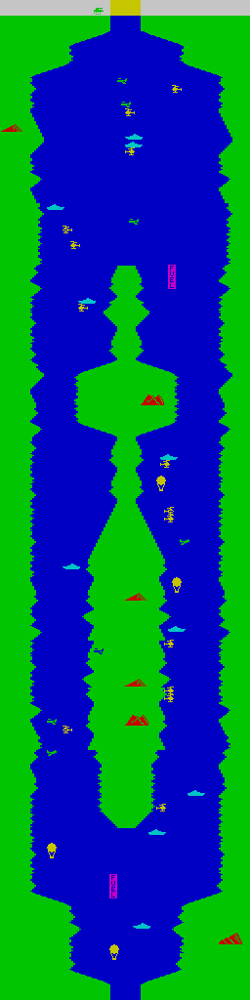
   ### Level 33
   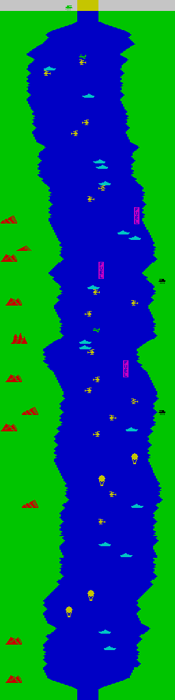
   ### Level 34
   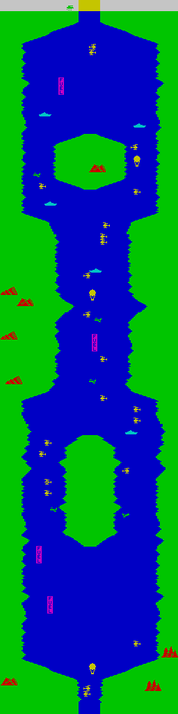
   ### Level 35
   
   ### Level 36
   
   ### Level 37
   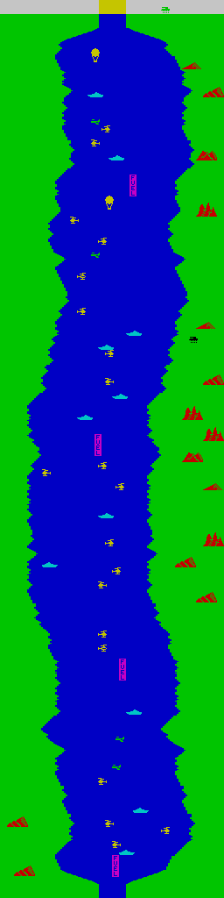
   ### Level 38
   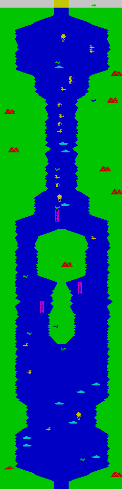
   ### Level 39
   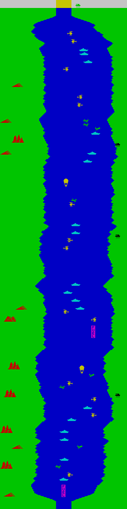
   ### Level 40
   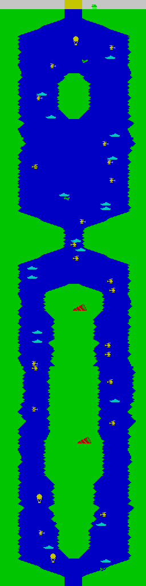
   ### Level 41
   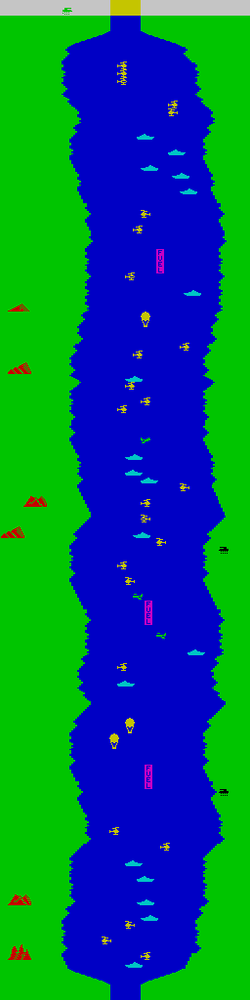
   ### Level 42
   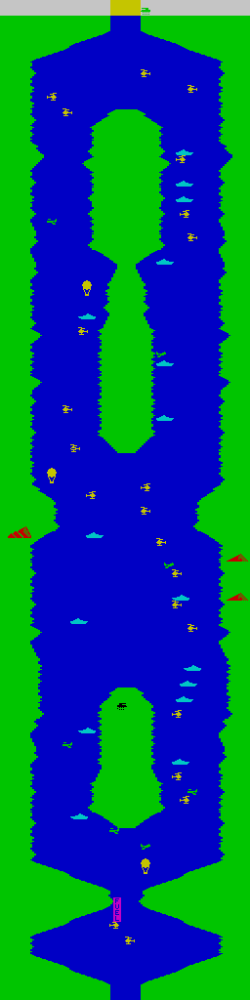
   ### Level 43
   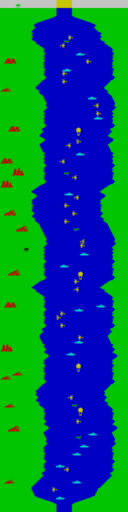
   ### Level 44
   
   ### Level 45
   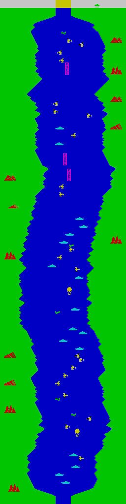
   ### Level 46
   
   ### Level 47
   
   ### Level 48
   
<details>
